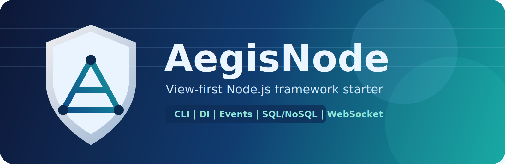

# AegisNode



AegisNode is a modular, view-first Node.js framework for building web apps, JSON APIs, and hybrid projects without spending the first part of the project wiring the same infrastructure again and again.
It gives you a structured project layout, runtime injection, CLI scaffolding, and production-ready defaults while still keeping the Node.js and Express ecosystem familiar.

AegisNode is designed for developers who want more structure than raw Express, but do not want a framework that hides the Node.js runtime behind too many abstractions.
It keeps the request/response model familiar while organizing the codebase around clear app boundaries, runtime-injected dependencies, and reusable layers such as views, services, models, validators, and subscribers.

It works well for projects that mix server-rendered pages and JSON endpoints, for teams that want a consistent project shape from the start, and for codebases that need built-in support for common backend concerns like auth, uploads, i18n, mail, maintenance mode, and environment-driven configuration.
The goal is to reduce setup time, remove repetitive infrastructure work, and give the project a cleaner long-term structure without making day-to-day development feel heavy.

## Documentation Guide

If you are new to AegisNode, read this README in this order:
- Quick Start: create a project, install dependencies, run the server, and understand startup mode rules.
- Core Concepts And App Structure: understand apps, layers, injected runtime context, and project flow.
- Common Tasks And Feature Guides: uploads, API apps, auth, templates, i18n, mail, and related features.
- Full Settings Reference: use this as the complete config manual once you already know what feature you need.
- Runtime Patterns And Advanced Topics: validators, strict layers, subscribers, and security details.

Standalone HTML handbook:
- Open `docs/index.html` in a browser for a sidebar-based documentation view.

## How AegisNode Helps

AegisNode helps by standardizing the parts that usually consume time early in a project:
- project scaffolding and app generation,
- route and layer organization,
- dependency injection and shared runtime context,
- config loading and environment overrides,
- auth, upload, mail, websocket, and i18n integration,
- operational helpers such as health checks, maintenance mode, and project diagnostics.

This means you spend less time writing framework glue and more time writing business features.

## Why Use AegisNode

Choose AegisNode if you want a project starter that remains readable as it grows.
It keeps the development model simple, but adds enough structure and tooling to make larger codebases easier to navigate, extend, and maintain.

Core features:

- CLI generators (`startproject`, `createapp`, `runserver`)
- Project health checker (`doctor`)
- Dependency updater (`updatedeps`)
- Maintenance mode with custom HTML responses
- Generators for app artifacts (`generate view|model|validator|dto|service|subscriber|route`)
- DI container
- Event system with subscribers
- Modular app structure
- SQL/NoSQL bootstrap via QueryMesh/Mongoose
- WebSocket bootstrap using Socket.IO
- Built-in file uploads with size/type limits (`route.upload`)
- Built-in mail transport wrapper (`mail.send`, `req.aegis.mail.send`)
- Centralized config and loaders
- Security headers via Helmet (configurable CSP) + CSRF protection for form submissions
- Built-in rate limiting for basic DDoS resistance
- Root route file `routes.js` (not `routes/` folder)
- Automatic default confirmation page on `/` when no custom `/` route exists
- App folder uses `views.js` (not `controllers/` folder)
- `createapp` uses file modules: `views.js`, `models.js`, `validators.js`, `routes.js`, `subscribers.js`, `services.js`
- `createapp` also generates app tests in `apps/<app>/tests`
- EJS templates configurable in `settings.js` with Django-style base layout flow
- Built-in runtime helpers (`money`, `number`, `dateTime`, `timeElapsed`, `toObjectId`) + `jlive` bridge

`startproject` creates `app.js`, `loader.cjs`, `.env`, `settings.js`, and `routes.js` without creating any default app.
It does not create `public/` or `logs/`; create your own folders and set them in `settings.js`.

Environment files are loaded automatically before `settings.js` is imported.
Supported files:
- `.env`
- `.env.local`
- `.env.<NODE_ENV>`
- `.env.<NODE_ENV>.local`

Shell or hosting-panel environment variables win over values from `.env` files.

## Quick Start

### CLI

```bash
npm install -g aegisnode

aegisnode startproject blog
npm --prefix blog install
aegisnode runserver --project blog

aegisnode createapp users --project blog
aegisnode generate view profile --app users --project blog
aegisnode generate route profile --app users --project blog
aegisnode doctor --project blog
aegisnode updatedeps --project blog
```

`cd blog` is optional. You can run commands from parent folder with `--project blog`.

`createapp`, `generate`, `runserver`, `doctor`, and `updatedeps` are project-level commands.
Run them from the project root; do not `cd` into `apps/<app>`.
Startup mode rules:
- Development (`env === development`): start with `aegisnode runserver` only.
- Non-development (`env !== development`): start with `node loader.cjs` (or your process manager/host pointing to `loader.cjs`).
- `node app.js` and `node loader.cjs` are rejected in development mode.
- `aegisnode runserver` is rejected outside development mode.

### Deploy On Phusion Passenger

AegisNode supports Passenger-style startup using the generated `loader.cjs`.

Passenger setup (Apache/Nginx/Plesk/cPanel/etc.):
1. Set **Application Root** to your project folder.
2. Set **Startup File** to `loader.cjs`.
3. Install dependencies in project root (for example: `npm install --omit=dev`).
4. Set environment variables (at minimum `NODE_ENV=production`; keep `PORT` managed by Passenger).
5. Restart the Node app from your hosting panel/service.

Plesk note: these map to **Application Root** and **Application Startup File** fields.

HTTPS note:
- If TLS is terminated by Passenger/Apache/Nginx, keep `https.enabled` off and set top-level `trustProxy` to `1` (or another exact proxy-hop/subnet value) so `req.secure`, secure cookies, and OAuth2 HTTPS checks work correctly.
- Only enable `https` in `settings.js` when Node itself should serve TLS directly.

How it works:
- `loader.cjs` imports `app.js`.
- `app.js` starts AegisNode with project root resolved from its own file location, so it works correctly under Passenger.


Generated routes are auto-wired into `apps/<app>/routes.js`.
`createapp` auto-detects the project root when run inside the project or from a parent folder containing exactly one AegisNode project.
After `createapp user`, `routes.js` is updated with central mapping style:
`route.use('/user', user);`
Only apps declared in `settings.apps` are allowed to load/mount. Startup fails when routes reference an undeclared app.
`--mount` accepts only safe path segments (`a-z`, `A-Z`, `0-9`, `_`, `-`, `:`).

By default, new app routes are API-ready:
- `GET /<mount>` list
- `POST /<mount>` create
- `GET /<mount>/:id` read
- `PUT /<mount>/:id` update
- `DELETE /<mount>/:id` delete

Default flow is `route -> validator -> service -> model`.
Default app tests generated by `createapp`:
- `apps/<app>/tests/models.test.js`
- `apps/<app>/tests/validators.test.js`
- `apps/<app>/tests/services.test.js`
- `apps/<app>/tests/routes.test.js`

Run all project tests:

```bash
npm test
```

Run project preflight checks:

```bash
aegisnode doctor
```

`doctor` checks:
- Project structure (`settings.js`, `routes.js`, app folders)
- App declarations vs filesystem
- Security baseline (`appSecret`, csrf/headers/ddos toggles)
- Auth safety checks (JWT secret, OAuth2 `allowHttp` in production)
- Template directory availability

Update project dependencies to the current npm `latest` dist-tag:

```bash
aegisnode updatedeps
```

`updatedeps` rewrites `dependencies`, `devDependencies`, `optionalDependencies`, and
`peerDependencies` in the project `package.json`, then runs the detected package manager's
`install`. It skips non-registry specs such as `file:`, `workspace:`, and git/http sources.

### Maintenance Mode

Enable maintenance mode in `settings.js` to serve a maintenance route with `503 Service Unavailable`.
If that route is missing or does not respond, AegisNode renders its internal maintenance fallback view:

```js
export default {
  maintenance: {
    enabled: true,
    route: '/maintenance',
    excludePaths: ['/health'],
    retryAfter: 120,
  },
};
```

```js
export default {
  register(route) {
    route.get('/maintenance', (req, res) => {
      res.render('maintenance', {
        title: 'Scheduled maintenance',
      });
    });
  },
};
```

Notes:
- `maintenance.route` is internally rewritten, so requests like `/users` can display your maintenance page without a redirect.
- If `maintenance.route` is not defined, or the route does not answer, the bundled fallback view is rendered.
- `excludePaths` lets selected endpoints keep running during maintenance.
- `retryAfter` sets the HTTP `Retry-After` header.
- `maintenance: true` uses the built-in default maintenance page.
- `maintenance: '<html>...</html>'` is still accepted as a shorthand for direct custom HTML.

### Generated Settings Config

`startproject` generates a minimal `settings.js` and runtime defaults fill the rest.

Access environment values anywhere with `process.env`:

```js
export default {
  port: process.env.PORT ? Number(process.env.PORT) : 3000,
  security: {
    appSecret: process.env.APP_SECRET || '',
  },
};
```

Injected app layers also receive `env`, so views/services/models/validators/controllers/subscribers/loaders can use `env.MY_NAME` without importing `process.env`.

`settings.js` (generated shape):

```js
export default {
  appName: 'blog',
  env: process.env.NODE_ENV || 'development',
  host: process.env.HOST || '0.0.0.0',
  port: process.env.PORT ? Number(process.env.PORT) : 3000,
  trustProxy: false,
  security: {
    appSecret: process.env.APP_SECRET || '',
  },
  logging: {
    level: process.env.LOG_LEVEL || 'info',
  },
  database: {
    enabled: false,
    dialect: 'pg',
    config: {},
    options: {},
  },
  cache: {
    enabled: true,
    driver: 'memory',
    options: {},
  },
  apps: [
    // AEGIS_APPS_START
    // AEGIS_APPS_END
  ],
};
```

Notes:
- Keep `AEGIS_APPS_START/END` markers; `createapp` updates this list automatically.
- `startproject` also writes a local `.env` with a generated `APP_SECRET`.
- Add optional blocks manually only when needed: `https`, `templates`, `i18n`, `helpers`, `staticDir`, `websocket`, `uploads`, `mail`, `auth`, `api`, `swagger`, `loaders`, `environments`, `architecture`, `security.headers/ddos/csrf`.
- Any section you omit uses framework defaults from `src/runtime/config.js`.

## Core Concepts And App Structure

### App File Usage Examples

Each generated app usually contains:
- `apps/<app>/views.js`
- `apps/<app>/models.js`
- `apps/<app>/services.js`
- `apps/<app>/subscribers.js`
- `apps/<app>/routes.js`

Usage by file:
- `views.js`: HTTP handlers (`req`, `res`, `next`). Default signature can be context-first: `handler({ service, validator, services, validators, ... }, req, res, next)`.
- `models.js`: data access layer only (SQL/NoSQL operations).
- `services.js`: business logic layer; orchestrates models.
- `subscribers.js`: event listeners (for example `app.booted`, `ws.connection`, custom events).
- `routes.js`: route mapping only (`route.get(...)`, `route.post(...)`, `route.use(...)`) to view handlers.

Route modules are mapping-only (`register(route)`).
Framework context is injected into handlers as first argument (when handler uses 4 args): `{ service, validator, services, models, validators, auth, mail, helpers, i18n, events, ... }`.
`req.aegis` is also available.
`service`/`validator` are app-scoped conveniences. For root/non-app routes, use `services.get('<app>.<name>')` / `validators.get('<app>.<name>')`, or create an app-scoped accessor with `services.forApp('<app>')`.

What “app-scoped” means:
- In app routes (for example inside `apps/users/routes.js`), `{ service }` resolves to that app service.
- In root/global routes (`routes.js`), there is no single app context, so use `{ services }` and fetch with `services.forApp('<app>').get('<name>')` or `services.get('<app>.<name>')`.

Injected runtime dependencies:

AegisNode injects resolved runtime objects instead of asking app layers to import framework internals. `config` is the resolved runtime config from `settings.js` plus defaults and runtime overrides.

Available by layer:
- Views/handlers (`views.js` or any context-first route/controller action): `appName`, `app`, `config`, `env`, `i18n`, `mail`, `logger`, `events`, `cache`, `io`, `auth`, `helpers`, `jlive`, `upload`, `services`, `models`, `validators`, `service`, `model`, `validator`, `database`, `dbClient`
- Services (`constructor({ ... })`): `appName`, `config`, `env`, `i18n`, `mail`, `logger`, `events`, `cache`, `io`, `auth`, `helpers`, `jlive`, `models`, `validators`, `services`
- Models (`constructor({ ... })`): `appName`, `config`, `env`, `i18n`, `mail`, `logger`, `events`, `cache`, `io`, `helpers`, `jlive`, `dbClient`, `database`
- Validators (`constructor({ ... })`): `appName`, `config`, `env`, `i18n`, `mail`, `logger`, `events`, `cache`, `io`, `auth`, `helpers`, `jlive`, `dbClient`, `database`
- Subscribers (`export default function ({ ... })`): `appName`, `rootDir`, `config`, `env`, `i18n`, `mail`, `logger`, `events`, `cache`, `io`, `auth`, `helpers`, `jlive`, `upload`, `services`, `models`, `validators`, `database`, `dbClient`, `app`, `server`, `templates`, `protocol`, `container`, `declaredAppNames`
- Controllers (`constructor({ ... })`): `appName`, `rootDir`, `config`, `env`, `i18n`, `mail`, `logger`, `events`, `cache`, `io`, `auth`, `helpers`, `jlive`, `upload`, `services`, `models`, `validators`, `database`, `dbClient`, `container`, `app`
- Loaders (`loaders` entry function): `rootDir`, `config`, `env`, `i18n`, `mail`, `logger`, `events`, `cache`, `io`, `auth`, `helpers`, `jlive`, `upload`, `services`, `models`, `validators`, `database`, `dbClient`, `app`, `server`, `templates`, `protocol`, `container`, `declaredAppNames`, `options`
- Request bridge (`req.aegis`): `config`, `env`, `i18n`, `locale`, `localeSource`, `t`, `setLocale`, `logger`, `events`, `cache`, `io`, `auth`, `mail`, `helpers`, `jlive`, `upload`, `services`, `models`, `validators`, `database`, `dbClient`, `appName`, `app`
- Template locals: `helpers`, `jlive`, `t`, `locale`, `i18n`, `money`, `number`, `dateTime`, `timeElapsed`, `timeDifference`, `breakStr`

Key meanings:

| Key | Description |
| --- | --- |
| `config` | Resolved runtime config from `settings.js`, framework defaults, environment overrides, and runtime overrides. |
| `env` | Frozen environment snapshot (`process.env` plus runtime additions such as `APP_SECRET`). |
| `i18n` | Translator bridge. During a request it follows the active request locale; outside a request it falls back to `defaultLocale` unless you pass `{ locale }`. |
| `mail` | Mail manager. Use `mail.send({ to, subject, text/html })` or `mail.sendMail(...)`. |
| `logger` | Runtime logger instance. |
| `events` | Event bus used by subscribers and app code. |
| `cache` | Cache backend instance (memory by default). |
| `io` | Socket.IO server instance when websocket support is enabled. |
| `auth` | Auth manager for JWT/OAuth2 flows. |
| `helpers` | Runtime helper functions such as `money`, `number`, `dateTime`, and `timeElapsed`. |
| `jlive` | jlive bridge instance. |
| `upload` | Upload manager used by `route.upload`. |
| `services` | Layer accessor used to fetch services by app/name. |
| `models` | Layer accessor used to fetch models by app/name. |
| `validators` | Layer accessor used to fetch validators by app/name. |
| `service` | App-scoped convenience service for the current app only. |
| `model` | App-scoped convenience model for the current app only. |
| `validator` | App-scoped convenience validator for the current app only. |
| `database` | Database runtime wrapper. |
| `dbClient` | Low-level database/query client. |
| `appName` | Current app name. |
| `app` | Current app metadata/context. |
| `rootDir` | Absolute project root. |
| `server` | HTTP/HTTPS server instance. |
| `templates` | Resolved template-engine configuration. |
| `protocol` | Server protocol (`http` or `https`). |
| `container` | Internal DI container. |
| `declaredAppNames` | Set of apps declared in config/routes. |
| `options` | Loader-specific options object from a `{ path, options }` loader entry. |
| `locale` | Active request locale. Available on `req.aegis` and template locals. |
| `localeSource` | Where the current locale came from (`query`, `cookie`, `header`, `manual`, or `disabled`). |
| `t` | Convenience translator shortcut for the current request/template scope. |
| `setLocale` | Request helper used to change and optionally persist the active locale. |

```js
// routes.js (root/global)
export default {
  register(route) {
    route.get('/dashboard', async ({ services }, req, res, next) => {
      try {
        const usersService = services.forApp('users').get('users');
        const ordersService = services.forApp('orders').get('orders');
        res.json({
          users: await usersService.list(),
          orders: await ordersService.list(),
        });
      } catch (error) {
        next(error);
      }
    });
  },
};
```

Example `views.js`:

```js
class UsersView {
  static async index({ service }, req, res, next) {
    try {
      const data = await service.listUsers();
      res.json({ data });
    } catch (error) {
      next(error);
    }
  }

  static async create({ service, validator }, req, res, next) {
    try {
      const payload = validator.create(req.body || {});
      const created = await service.createUser(payload);
      res.status(201).json({ data: created });
    } catch (error) {
      next(error);
    }
  }

  static async tools({ service, helpers, jlive }, req, res, next) {
    try {
      const stats = await service.stats();
      res.json({
        stats,
        total: helpers.money(1299.5, { currency: 'USD' }),
        elapsed: helpers.timeElapsed(Date.now() - 60_000),
        token: jlive.generate(16),
      });
    } catch (error) {
      next(error);
    }
  }
}

export default UsersView;
```

Example `models.js`:

```js
class UsersModel {
  constructor({ dbClient }) {
    this.dbClient = dbClient;
  }

  async list() {
    return [{ id: '1', name: 'Alice' }];
  }

  async create(payload) {
    return { id: '2', ...payload };
  }
}

export default { users: UsersModel };
```

Example `services.js`:

```js
class UsersService {
  constructor({ models, env }) {
    this.usersModel = models.get('users');
    this.env = env;
  }

  async listUsers() {
    return this.usersModel.list();
  }

  async createUser(payload) {
    return this.usersModel.create(payload);
  }
}

export default { users: UsersService };
```

Example `subscribers.js`:

```js
export default function registerUsersSubscribers({ events, logger }) {
  events.subscribe('app.booted', ({ appName }) => {
    logger.info('[users] booted: %s', appName);
  });
}
```

Injected `env` is also available in:
- view handler context: `static index({ env }, req, res) { ... }`
- model constructors: `constructor({ dbClient, env }) { ... }`
- subscribers: `export default function ({ events, env }) { ... }`
- request runtime bridge: `req.aegis.env`

Example `routes.js`:

```js
import UsersView from './views.js';

export default {
  appName: 'users',
  register(route) {
    route.get('/home', UsersView.home);
    route.get('/', UsersView.index);
    route.post('/', UsersView.create);
  },
};
```

## Common Tasks And Feature Guides

### File Uploads

AegisNode provides built-in upload middleware on route API as `route.upload`.

Storage location:
- Default folder: `<project-root>/uploads`
- Change with `settings.uploads.dir` (relative or absolute path)

Recommended upload settings:

```js
uploads: {
  enabled: true,
  dir: 'storage/uploads',
  createDir: true,
  preserveExtension: true,
  maxFileSize: '5mb',
  maxFiles: 5,
  maxFields: 50,
  maxFieldSize: '1mb',
  allowedMimeTypes: ['image/png', 'image/jpeg'],
  allowedExtensions: ['.png', '.jpg', '.jpeg'],
  allowApiMultipart: true,
},
```

Route middleware modes:

```js
import UsersView from './views.js';

export default {
  appName: 'users',
  register(route) {
    // One file -> req.file
    route.post('/avatar', route.upload.single('avatar'), UsersView.uploadAvatar);

    // Many files from one input name -> req.files (array)
    route.post('/gallery', route.upload.array('photos', 6), UsersView.uploadGallery);

    // Many named file inputs -> req.files.<fieldName> (array)
    route.post(
      '/documents',
      route.upload.fields([
        { name: 'avatar', maxCount: 1 },
        { name: 'docs', maxCount: 3 },
      ]),
      UsersView.uploadDocuments,
    );

    // Accept all file fields -> req.files (array)
    route.post('/any-upload', route.upload.any(), UsersView.uploadAny);

    // No files, parse multipart text fields only
    route.post('/multipart-no-file', route.upload.none(), UsersView.multipartNoFile);
  },
};
```

`req` payload shape:
- `single()`: `req.file` + `req.body`
- `array()`: `req.files` (array) + `req.body`
- `fields()`: `req.files` object (`req.files.avatar`, `req.files.docs`, ...) + `req.body`

Custom route with form fields + file:

```js
// apps/users/routes.js
import UsersView from './views.js';

export default {
  appName: 'users',
  register(route) {
    route.post('/profile/update', route.upload.single('avatar'), UsersView.updateProfile);
  },
};
```

```js
// apps/users/views.js
class UsersView {
  static updateProfile(_context, req, res) {
    const { username, bio } = req.body;
    const avatar = req.file || null;

    return res.json({
      username,
      bio,
      avatar: avatar ? {
        name: avatar.filename,
        originalName: avatar.originalname,
        mimeType: avatar.mimetype,
        size: avatar.size,
        path: avatar.path,
      } : null,
    });
  }
}

export default UsersView;
```

```html
<form action="/users/profile/update" method="POST" enctype="multipart/form-data">
  <%= csrfToken %>
  <input name="username" />
  <textarea name="bio"></textarea>
  <input type="file" name="avatar" />
  <button type="submit">Save</button>
</form>
```

Upload limits and rejections:
- Per-file size limit from `uploads.maxFileSize` returns `413` when exceeded.
- Total files limit from `uploads.maxFiles` returns `413` when exceeded.
- `allowedMimeTypes` / `allowedExtensions` mismatch returns `415`.

Important behavior:
- If `uploads.enabled=false`, using `route.upload.*` throws at route registration.
- For API mounts, multipart is allowed only when `uploads.allowApiMultipart=true`.
- For non-API form submissions, CSRF token is required by default.

### API Apps

`api` does not create a separate app type. You still build a normal AegisNode app with `routes.js`, `views.js`, `services.js`, and `validators.js`.
The `api` setting only changes middleware behavior for selected app mounts.

Think of it this way:
- `api` controls request/response behavior for an app mount.
- `auth` controls who can access routes and how tokens are issued/verified.
- You can use `api` without auth, auth without `api`, or both together.

Common combinations:
- `api` only: public or internal JSON endpoints with no token auth.
- `api` + JWT: first-party SPA/mobile/frontend calling your own backend.
- `api` + OAuth2: third-party clients, machine-to-machine access, or standards-based authorization flows.

Quick start:

1. Declare the app in `settings.apps` and give it a mount.
2. Add that app name to `api.apps`.
3. Mount the app at the same path in `routes.js` when `autoMountApps` is off.
4. Return JSON from your handlers.
5. Send JSON for unsafe methods unless you intentionally allow multipart uploads.

Example `settings.js`:

```js
export default {
  apps: [
    { name: 'users', mount: '/users' },
  ],
  api: {
    apps: ['users'],
    disableCsrf: true,
    requireJsonForUnsafeMethods: true,
    noStoreHeaders: true,
  },
};
```

Example root `routes.js`:

```js
import users from './apps/users/routes.js';

export default {
  register(route) {
    route.use('/users', users); // keep this aligned with settings.apps[].mount
  },
};
```

Example `apps/users/routes.js`:

```js
import UsersView from './views.js';

export default {
  appName: 'users',
  register(route) {
    route.get('/', UsersView.index);
    route.post('/', UsersView.create);
  },
};
```

Example `apps/users/views.js`:

```js
class UsersView {
  static async index({ service }, req, res, next) {
    try {
      const users = await service.list();
      res.json({ data: users });
    } catch (error) {
      next(error);
    }
  }

  static async create({ service, validator }, req, res, next) {
    try {
      const payload = validator.create(req.body || {});
      const created = await service.create(payload);
      res.status(201).json({ data: created });
    } catch (error) {
      next(error);
    }
  }
}

export default UsersView;
```

Example requests:

```bash
curl http://127.0.0.1:3000/users

curl -X POST http://127.0.0.1:3000/users \
  -H "Content-Type: application/json" \
  -d '{"name":"Alice"}'
```

What the API middleware changes:
- `POST`, `PUT`, `PATCH`, and `DELETE` with a request body must use `application/json` when `requireJsonForUnsafeMethods: true`.
- `multipart/form-data` is still allowed for API mounts when `uploads.allowApiMultipart: true`.
- CSRF is skipped only for configured API app mounts when `disableCsrf: true`.
- API responses get `Cache-Control: no-store` when `noStoreHeaders: true`.

What it does not change:
- It does not auto-generate CRUD endpoints.
- It does not force a separate `controllers/` or `api/` folder.
- It does not convert a view into JSON automatically; your handler still decides what to return.

### API And Auth Together

`api` and `auth` are separate features that are often used together:

- `api` makes an app behave like an API mount: JSON body enforcement, optional CSRF skip, and `Cache-Control: no-store`.
- `auth` adds token issuance, token verification, route protection, client registration, and revocation/introspection behavior.

Examples:
- Public JSON API: enable `api`, leave `auth.enabled` off.
- Protected JSON API for your own frontend/mobile app: enable `api` and `auth.provider = 'jwt'`.
- Protected partner/developer API: enable `api` and `auth.provider = 'oauth2'`.

Rule of thumb:
- If you only need JSON routes, use `api`.
- If you need authenticated access, add `auth`.
- If outside clients need a standard auth protocol, choose OAuth2 instead of rolling custom JWT login flows.

Quick comparison:

| Setup | Use it when | What you configure |
| --- | --- | --- |
| `api` only | You need JSON endpoints without token auth. Good for public read APIs or trusted internal services. | `api.apps = [...]` |
| `api` + JWT | Your own frontend/mobile app talks to your backend and you control both sides. | `api.apps = [...]`, `auth.enabled = true`, `auth.provider = 'jwt'`, plus your own login/token routes |
| `api` + OAuth2 | External clients, partner apps, or machine clients need standard token flows. | `api.apps = [...]`, `auth.enabled = true`, `auth.provider = 'oauth2'` |

### Database Config

Use `database.config` for every dialect (SQL and MongoDB/Mongoose):

```js
database: {
  enabled: true,
  dialect: 'pg', // pg | mysql | mssql | sqlite | oracle | mongo | mongodb | mongoose
  config: {
    // SQL example:
    server: 'localhost',
    port: 5432,
    user: 'postgres',
    password: 'postgres',
    database: 'appdb',

    // Mongo example:
    // connectionString: 'mongodb://localhost:27017/appdb',
    // or:
    // server: 'localhost',
    // port: 27017,
    // database: 'appdb',
    // user: 'mongo_user',
    // password: 'mongo_pass',
  },
  options: {},
},
```

Legacy note:
- `database.uri` is still accepted for MongoDB, but `database.config.connectionString` is preferred.

Model usage for `mongo` / `mongodb` / `mongoose`:
- `dbClient` is a QueryMesh client, so you can use the same fluent API as SQL models.

```js
class UsersModel {
  constructor({ dbClient }) {
    this.db = dbClient;
  }

  async list() {
    return this.db.table('users').select(['id', 'name']).get();
  }
}
```

Mongo `_id` / `ObjectId` handling:
- Use built-in helper `helpers.toObjectId(...)` before filtering on `_id`.
- Validate with `helpers.isObjectId(...)` when needed.
- Keep this conversion in model/service layer.
- If your collection stores string `_id` values (not native Mongo `ObjectId`), skip conversion.

```js
class UsersModel {
  constructor({ dbClient, helpers }) {
    this.db = dbClient;
    this.helpers = helpers;
  }

  async findById(id) {
    const _id = this.helpers.toObjectId(id);
    if (!_id) throw new Error('Invalid Mongo ObjectId');
    return this.db.table('users').where('_id', '=', _id).first();
  }
}
```

### Environment Overrides (Single settings.js)

You can keep a single `settings.js` and define per-environment overrides:

```js
export default {
  env: process.env.NODE_ENV || 'development',
  logging: {
    level: 'info',
  },
  security: {
    ddos: {
      maxRequests: 120,
    },
  },
  environments: {
    development: {
      logging: { level: 'debug' },
    },
    production: {
      logging: { level: 'warn' },
      security: { ddos: { maxRequests: 80 } },
    },
  },
};
```

Behavior:
- Base config is loaded first.
- `environments.default` is applied (if present).
- `environments[env]` is applied last.
- `env` comes from `settings.env` (fallback: `NODE_ENV`, then `development`).

### Auth (JWT Or OAuth2)

`auth` is independent from `api`.
You can protect normal web routes, API routes, or both.
If your app is already listed in `api.apps`, adding `auth` simply means those JSON routes can now require tokens.

Choose the provider based on who is calling your app:

- `provider: 'jwt'`
  Best for first-party apps you control.
  You create your own login/token/refresh/logout routes and call `auth.issue(...)` yourself.
- `provider: 'oauth2'`
  Best when you need a standard authorization server.
  AegisNode mounts `/oauth/*` endpoints for you and supports `authorization_code` + PKCE, `client_credentials`, and `refresh_token`.

Quick decision guide:
- Use JWT when your own frontend/mobile app talks only to your backend.
- Use OAuth2 when external clients, partner apps, or machine-to-machine integrations need standard token flows.
- Use `auth.middleware()` to protect routes in both modes.

Enable auth in `settings.js`:

```js
auth: {
  enabled: true,
  provider: 'jwt', // or 'oauth2'
  tablePrefix: 'aegisnode',
  storage: {
    // cache | memory | file | database
    driver: 'cache',
    filePath: 'storage/aegisnode-auth-store.json',
    // Used by database driver for both SQL table and Mongo collection.
    tableName: 'aegisnode_auth_store',
  },
  jwt: {
    secret: 'replace-with-strong-secret',
    algorithm: 'HS256',
    expiresIn: '15m',
    refreshExpiresIn: '7d',
    issuer: 'blog',
    audience: 'blog',
  },
  oauth2: {
    accessTokenTtlSeconds: 3600,
    refreshTokenTtlSeconds: 1209600,
    authorizationCodeTtlSeconds: 600,
    rotateRefreshToken: true,
    requireClientSecret: true,
    requirePkce: true,
    allowPlainPkce: false,
    grants: ['authorization_code', 'refresh_token', 'client_credentials'],
    defaultScopes: [],
    clientAuthMethod: 'client_secret_basic',
    server: {
      enabled: true,
      basePath: '/oauth',
      authorizePath: '/oauth/authorize',
      tokenPath: '/oauth/token',
      introspectionPath: '/oauth/introspect',
      revocationPath: '/oauth/revoke',
      metadataPath: '/.well-known/oauth-authorization-server',
      issuer: '',
      autoApprove: true,
      requireAuthenticatedUser: true,
      requireConsent: false,
      allowHttp: false,
    },
  },
},
```

`tablePrefix` is used for auth storage names when enabled:
- `${tablePrefix}_users`
- `${tablePrefix}_jwt_revocations`
- `${tablePrefix}_oauth_clients`
- `${tablePrefix}_oauth_authorization_codes`
- `${tablePrefix}_oauth_access_tokens`
- `${tablePrefix}_oauth_refresh_tokens`

By default, these names are used as key namespaces.
- With `storage.driver = 'cache'` or `memory`, they are in-memory/cache key prefixes.
- With `storage.driver = 'database'`, they are prefixes stored inside `auth.storage.tableName` (used as SQL table name or Mongo collection name).

Restart behavior:
- `auth.enabled = true`: auth manager is available in context after restart.
- `auth.enabled = false`: auth manager stays safe; `auth.middleware()` returns `503` instead of crashing boot.
- `auth.storage.driver = 'file'`: OAuth2 clients/tokens and JWT revocations persist across restarts.
- `auth.storage.driver = 'database'`: OAuth2 clients/tokens and JWT revocations persist in your configured `database` backend.

JWT usage in routes:

- JWT does not create login routes for you.
- You define the endpoints that authenticate users and issue tokens.
- This is usually the simplest choice for a private API used only by your own frontend/mobile app.

```js
export default {
  register(route) {
    const authGuard = (req, res, next) => req.aegis.auth.middleware()(req, res, next);

    route.get('/auth/token', (req, res) => {
      const token = req.aegis.auth.issue({ subject: 'u1', scope: ['read:users'] });
      res.json({ token });
    });

    route.get('/auth/me', authGuard, (req, res) => {
      res.json({ user: req.auth });
    });
  },
};
```

OAuth2 built-in authorization server endpoints (when `auth.provider='oauth2'` and `auth.oauth2.server.enabled=true`):

- `GET /oauth/authorize`
- `POST /oauth/authorize`
- `POST /oauth/token`
- `POST /oauth/introspect`
- `POST /oauth/revoke`
- `GET /.well-known/oauth-authorization-server`

Flows supported:
- `authorization_code` (with PKCE)
- `client_credentials`
- `refresh_token`

OAuth2 is the better choice when:
- you need standards-based client registration and token exchange,
- you need machine clients as well as browser/mobile clients,
- or third parties must integrate without depending on your custom JWT login route shape.

#### Route Usage (JWT vs OAuth2)

`startproject` gives you one root route file: `routes.js`.
All your custom HTTP routes are defined there (or in app routes you mount with `route.use(...)`).

```js
// routes.js
import users from './apps/users/routes.js';

export default {
  register(route) {
    route.use('/users', users);

    // Your custom auth/business routes
    route.post('/auth/login', (req, res) => {
      const token = req.aegis.auth.issue({ subject: 'u1' });
      res.json({ token });
    });
  },
};
```

How this behaves:
- `provider: 'jwt'`: Aegis does not create JWT endpoints automatically. You define login/token/refresh/logout routes yourself in `routes.js` (or mounted app routes).
- `provider: 'oauth2'`: Aegis auto-mounts OAuth2 server endpoints (`/oauth/authorize`, `/oauth/token`, `/oauth/introspect`, `/oauth/revoke`, metadata). You only define your own extra routes (for example admin client setup, protected APIs, business routes).
- Do not reuse built-in OAuth2 endpoint paths for your own handlers when OAuth2 server is enabled.

Typical setup patterns:
- API + JWT:
  `api.apps = ['users']`, `auth.provider = 'jwt'`, custom `/auth/login`, protect `/users/*` with `req.aegis.auth.middleware()`.
- API + OAuth2:
  `api.apps = ['users']`, `auth.provider = 'oauth2'`, use built-in `/oauth/token`, protect `/users/*` with `req.aegis.auth.middleware()`.
- Web app + JWT:
  no `api` block required if routes are normal form/web routes, but you can still use JWT for selected endpoints.

#### OAuth2 Full Usage

1. Register clients (server-side only)

Register clients programmatically with `auth.registerClient(...)`.
Do not expose this publicly in production without admin protection.

```js
export default {
  register(route) {
    route.post('/admin/oauth/setup-clients', (req, res) => {
      const webClient = req.aegis.auth.registerClient({
        clientId: 'web',
        clientSecret: 'secret',
        redirectUris: ['https://client.example.com/callback'],
        grants: ['authorization_code', 'refresh_token'],
        scopes: ['read:users'],
      });

      const machineClient = req.aegis.auth.registerClient({
        clientId: 'machine',
        clientSecret: 'machine-secret',
        grants: ['client_credentials'],
        scopes: ['read:users'],
      });

      res.json({ webClient, machineClient });
    });
  },
};
```

Notes:
- Secret is stored hashed (scrypt).
- Returned client object does not include the secret/hash.
- `authorization_code` clients must have at least one `redirectUri`.

2. Authorization Code + PKCE flow

Create PKCE verifier/challenge:

```js
import crypto from 'crypto';

function b64url(buffer) {
  return Buffer.from(buffer).toString('base64')
    .replace(/\+/g, '-')
    .replace(/\//g, '_')
    .replace(/=+$/g, '');
}

const codeVerifier = b64url(crypto.randomBytes(48));
const codeChallenge = b64url(crypto.createHash('sha256').update(codeVerifier).digest());
```

Redirect user-agent to authorize endpoint:

```txt
GET /oauth/authorize
  ?response_type=code
  &client_id=web
  &redirect_uri=https%3A%2F%2Fclient.example.com%2Fcallback
  &scope=read%3Ausers
  &state=abc123
  &code_challenge=<CODE_CHALLENGE>
  &code_challenge_method=S256
```

The server redirects back to:

```txt
https://client.example.com/callback?code=<AUTH_CODE>&state=abc123
```

Exchange code for tokens:

```bash
curl -X POST http://127.0.0.1:3000/oauth/token \
  -H "Content-Type: application/x-www-form-urlencoded" \
  -u web:secret \
  -d "grant_type=authorization_code" \
  -d "code=<AUTH_CODE>" \
  -d "redirect_uri=https://client.example.com/callback" \
  -d "code_verifier=<CODE_VERIFIER>"
```

Response shape:

```json
{
  "access_token": "...",
  "token_type": "Bearer",
  "expires_in": 3600,
  "scope": "read:users",
  "refresh_token": "...",
  "refresh_expires_in": 1209600
}
```

3. Protect API routes with OAuth2 access tokens

```js
export default {
  register(route) {
    const authGuard = (req, res, next) => req.aegis.auth.middleware()(req, res, next);
    route.get('/users/me', authGuard, (req, res) => {
      res.json({
        sub: req.auth.sub || null,
        clientId: req.auth.clientId,
        scope: req.auth.scope,
      });
    });
  },
};
```

Use token:

```bash
curl http://127.0.0.1:3000/users/me \
  -H "Authorization: Bearer <ACCESS_TOKEN>"
```

4. Refresh token flow

```bash
curl -X POST http://127.0.0.1:3000/oauth/token \
  -H "Content-Type: application/x-www-form-urlencoded" \
  -u web:secret \
  -d "grant_type=refresh_token" \
  -d "refresh_token=<REFRESH_TOKEN>"
```

5. Client Credentials flow (machine-to-machine)

```bash
curl -X POST http://127.0.0.1:3000/oauth/token \
  -H "Content-Type: application/x-www-form-urlencoded" \
  -u machine:machine-secret \
  -d "grant_type=client_credentials" \
  -d "scope=read:users"
```

This returns access token only (no refresh token).

6. Introspection and revocation

Introspection:

```bash
curl -X POST http://127.0.0.1:3000/oauth/introspect \
  -H "Content-Type: application/x-www-form-urlencoded" \
  -u web:secret \
  -d "token=<ACCESS_TOKEN>"
```

Revocation:

```bash
curl -X POST http://127.0.0.1:3000/oauth/revoke \
  -H "Content-Type: application/x-www-form-urlencoded" \
  -u web:secret \
  -d "token=<ACCESS_OR_REFRESH_TOKEN>"
```

7. Custom subject/consent resolution

By default, `/oauth/authorize` resolves subject from:
- `req.user.id`
- `req.user.sub`
- `req.auth.sub`
- `subject`/`user_id` query/body params

You can override with hooks in `settings.js`:

```js
auth: {
  provider: 'oauth2',
  oauth2: {
    server: {
      resolveSubject: ({ req }) => req.user?.id || '',
      resolveConsent: ({ req, client, subject }) => {
        // return true to approve, false to deny
        return true;
      },
    },
  },
},
```

8. Production checklist

- Keep `auth.oauth2.server.allowHttp = false` (default).
- Use HTTPS with trusted reverse proxy config.
- Keep `requirePkce = true`.
- Use strong client secrets and rotate regularly.
- Restrict client setup endpoints to admins only.
- Set explicit `defaultScopes` and per-client scopes.
- Set `issuer` to your public auth server URL.

Implementation notes:
- OAuth2 server in AegisNode is framework-native (custom implementation).
- CSRF checks are skipped for OAuth2 server endpoints (`/oauth/*` + metadata) by design.
- This is OAuth2 (not OpenID Connect); no `id_token` endpoint/flow.

### Swagger (OpenAPI UI)

Enable Swagger in `settings.js`:

```js
swagger: {
  enabled: true,
  docsPath: '/docs',
  jsonPath: '/openapi.json',
  documentPath: 'openapi.json',
  explorer: true,
},
```

Behavior:
- UI available at `docsPath` (default `/docs`).
- OpenAPI JSON available at `jsonPath` (default `/openapi.json`).
- If `openapi.json` exists in project root, it is loaded.
- If no file is found, AegisNode serves a default minimal OpenAPI document.

### Templates (EJS + base.ejs)

Set template config in `settings.js`:

```js
templates: {
  enabled: true,
  engine: 'ejs',
  dir: 'templates',
  base: 'base',
  appBases: {
    users: 'users/base',
    admin: 'admin/base',
  },
}
```

Then in a route handler:

```js
route.get('/', (req, res) => {
  res.render('home', {
    title: 'Home',
    message: 'Welcome',
  });
});
```

`home.ejs` is rendered first, then injected into `base.ejs`.
Use `<%- content %>` (or `<%- body %>`) in your `base.ejs` to print page content.

### Internationalization (i18n)

Configure i18n in `settings.js`:

```js
i18n: {
  enabled: true,
  defaultLocale: 'en',
  fallbackLocale: 'en',
  supported: ['en', 'fr'],
  queryParam: 'lang',
  translations: {
    en: {
      home: {
        title: 'Welcome {name}',
      },
    },
    fr: {
      home: {
        title: 'Bienvenue {name}',
      },
    },
  },
}
```

You can also load locale JSON files directly (no import needed):

```js
i18n: {
  enabled: true,
  defaultLocale: 'en',
  supported: ['en', 'fr'],
  translations: {
    en: 'locales/en.json',
    fr: 'locales/fr.json',
  },
  // optional single-file source (inline `translations` wins per locale key):
  // translationsFile: 'locales/all.json',
}
```

Route usage:

```js
route.get('/i18n-demo', (req, res) => {
  // Auto-detected from query/cookie/header.
  res.json({
    locale: req.aegis.locale,
    title: req.aegis.t('home.title', { name: 'Jason' }),
  });
});
```

Choosing the API:

- `req.aegis.t('home.title')`
  Shortcut for `req.aegis.i18n.t('home.title')`. Use this in routes/views when you only need a translated string.
- `req.aegis.i18n`
  Request-scoped i18n object. Use this when you also need locale metadata or helpers such as `locale`, `localeSource`, `setLocale(...)`, `resolveLocale(...)`, or `forLocale(...)`.
- Injected `i18n` in handlers/services/models/validators/controllers/subscribers/loaders
  Runtime-injected i18n bridge. During an HTTP request, `i18n.t(...)` resolves with the same active locale as `req.aegis.i18n.t(...)`, so the translation result is the same.

Important differences:

- `req.aegis.t` and `req.aegis.i18n.t` return the same translation for the current request.
- Injected `i18n.t(...)` in a service/model/validator/subscriber is not the same object as `req.aegis.i18n`, but during a request it produces the same translation result for the same key/options.
- Outside a request, injected `i18n.t(...)` falls back to `defaultLocale`.
- In background jobs, loaders, or boot-time code, pass an explicit locale when needed: `i18n.t('home.title', { name: 'Jason' }, { locale: 'fr' })`.

Service/model usage:

```js
class UsersService {
  constructor({ i18n }) {
    this.i18n = i18n;
  }

  greeting(name) {
    return this.i18n.t('home.title', { name });
  }
}
```

Template usage:

```ejs
<html lang="<%= locale %>">
  <body>
    <h1><%= t('home.title', { name: 'Jason' }) %></h1>
  </body>
</html>
```

Manual locale switch inside a request:

```js
route.get('/fr', (req, res) => {
  req.aegis.setLocale('fr'); // persists in i18n cookie by default
  res.send(req.aegis.t('home.title', { name: 'Jason' }));
});
```

Persist user-selected language as default:

```js
route.post('/lang', (req, res) => {
  const selected = String(req.body?.lang || '').trim();
  req.aegis.setLocale(selected); // writes i18n cookie (aegis_locale by default)
  res.redirect('back');
});
```

Language picker template (keeps selected option):

```ejs
<form method="post" action="/lang">
  <select name="lang">
    <option value="en" <%= locale === 'en' ? 'selected' : '' %>>English</option>
    <option value="fr" <%= locale === 'fr' ? 'selected' : '' %>>Français</option>
  </select>
  <button type="submit">Change</button>
</form>
```

Notes:
- `defaultLocale` is used only when user has no saved locale.
- After selection, cookie locale becomes the default for that user on next requests.
- `?lang=fr` also persists automatically when `detectFromQuery` is enabled.
- Templates get `t`, `locale`, and `i18n` in locals.

### Mail

Configure mail transport in `settings.js`:

```js
export default {
  mail: {
    enabled: true,
    defaults: {
      from: 'noreply@example.com',
      replyTo: 'support@example.com',
    },
    transport: {
      host: process.env.SMTP_HOST,
      port: process.env.SMTP_PORT ? Number(process.env.SMTP_PORT) : 587,
      secure: false,
      auth: {
        user: process.env.SMTP_USER,
        pass: process.env.SMTP_PASS,
      },
    },
    verifyOnStartup: true,
  },
};
```

Available mail APIs:

- Injected `mail` in handlers/services/models/validators/controllers/subscribers/loaders
  Shared runtime mail manager. Use `mail.send(...)` or `mail.sendMail(...)`.
- `req.aegis.mail`
  Request bridge to the same mail manager used in handler context.

Handler usage:

```js
route.post('/contact', async ({ mail }, req, res, next) => {
  try {
    const info = await mail.send({
      to: 'support@example.com',
      subject: 'Contact form',
      text: req.body?.message || '',
      html: `<p>${req.body?.message || ''}</p>`,
    });

    res.status(202).json({ messageId: info.messageId });
  } catch (error) {
    next(error);
  }
});
```

Service usage:

```js
class UsersService {
  constructor({ mail }) {
    this.mail = mail;
  }

  async sendWelcome(user) {
    return this.mail.send({
      to: user.email,
      subject: 'Welcome',
      html: `<h1>Hello ${user.name}</h1><p>Your account is ready.</p>`,
    });
  }
}
```

Notes:
- `mail.send(...)` and `mail.sendMail(...)` are the same method.
- Messages must include at least one of `to`, `cc`, or `bcc`.
- Messages must include `from`, or configure `mail.defaults.from`.
- For tests or custom providers, you can set `mail.transporter` or `mail.transportFactory` instead of `mail.transport`.

### Helpers And jlive

Helpers and the `jlive` bridge are available in request context (`req.aegis`) and in EJS locals.
They are also available in:
- Service constructors (`constructor({ helpers, jlive, env, i18n, models, ... })`)
- Model constructors (`constructor({ helpers, jlive, env, i18n, dbClient, ... })`)
- Subscribers context (`registerSubscribers({ helpers, jlive, env, i18n, events, ... })`)
- Any view/handler via request bridge: `req.aegis.helpers`, `req.aegis.jlive`, `req.aegis.env`, `req.aegis.locale`, `req.aegis.t`, `req.aegis.i18n`

Set helper defaults in `settings.js` (currency/locale):

```js
helpers: {
  locale: 'fr-FR',
  money: {
    currency: 'EUR',
    currencyDisplay: 'code',
  },
},
```

Then `helpers.money(2500)` automatically uses your configured defaults unless you pass per-call overrides.

Route usage:

```js
export default {
  register(route) {
    route.get('/tools', (req, res) => {
      res.json({
        price: req.aegis.helpers.money(1299.5, { currency: 'USD' }),
        createdAgo: req.aegis.helpers.timeElapsed(Date.now() - 60_000),
        createdAgoShort: req.aegis.helpers.timeElapsed(Math.floor(Date.now() / 1000) - 60, true),
        progress: req.aegis.helpers.timeDifference(65, 0, 100),
        summary: req.aegis.helpers.breakStr('AegisNode framework helper utilities', 18, '...', true),
        objectIdValid: req.aegis.helpers.isObjectId('507f1f77bcf86cd799439011'),
        objectIdString: req.aegis.helpers.toObjectId('507f1f77bcf86cd799439011')?.toString() || null,
        secret: req.aegis.jlive.generate(32),
        jliveAvailable: req.aegis.jlive.available,
      });
    });
  },
};
```

Template usage (`res.render(...)`):

```ejs
<h1><%= title %></h1>
<p>Total: <%= money(1299.5, { currency: 'USD' }) %></p>
<p>Updated: <%= timeElapsed(updatedAt) %></p>
<p>Progress: <%= timeDifference(65, 0, 100) %>%</p>
<p>Summary: <%= breakStr("AegisNode framework helper utilities", 18, "...", true) %></p>
<p>With helper object: <%= helpers.number(1000000) %></p>
```

Available EJS locals:
- `helpers`
- `jlive`
- `money`
- `number`
- `dateTime`
- `timeElapsed`
- `timeDifference`
- `breakStr`
- `isObjectId`
- `toObjectId`
- `locale`
- `t`
- `csrfToken` (raw hidden input HTML)
- `csrfValue` (token string)

`timeElapsed` supports both styles:
- `timeElapsed(value, { now, locale, numeric })` (Intl relative style)
- `timeElapsed(unixTime, true)` (short legacy-style mode)

Mongo id helpers:
- `isObjectId(value)` validates Mongo ObjectId format.
- `toObjectId(value)` returns a Mongo ObjectId instance or `null` when invalid.

`jlive` behavior:
- If `jlive` package is installed, bridge uses its methods.
- If not installed, `jlive.generate()` still works (crypto fallback), while crypto methods throw `JLIVE_UNAVAILABLE`.

### Template Locals From Settings

You can inject custom functions/classes into all template renders from `settings.js`:

```js
templates: {
  enabled: true,
  engine: 'ejs',
  dir: 'templates',
  base: 'base',
  locals: {
    formatCurrency: (value) => '$' + Number(value || 0).toFixed(2),
    ViewBag: class ViewBag {
      constructor(title) {
        this.title = title;
      }
    },
  },
},
```

You can also pass already-defined class/function references by name (object shorthand):

```js
import { formatCurrency, ViewBag } from './app/template-locals.js';

export default {
  templates: {
    locals: { formatCurrency, ViewBag },
  },
};
```

Note:
- Use JS references/imports (as above).
- String names like `{ formatCurrency: 'formatCurrency' }` are not auto-resolved.

Then in EJS:

```ejs
<p><%= formatCurrency(123.45) %></p>
<p><%= new ViewBag('Dashboard').title %></p>
```

<!-- SETTINGS_REFERENCE_START -->
## Full Settings Reference

All fields below are supported in `settings.js`. If you omit a field, AegisNode uses the runtime default.

Merge order used at startup:
1. Framework defaults (`defaultConfig`)
2. `settings.js`
3. Legacy `settings/index.js` (if present)
4. Legacy `settings/db.js` (merged into `database`)
5. Legacy `settings/cache.js` (merged into `cache`)
6. Legacy `settings/apps.js` (used only when `settings.js` does not define apps)
7. `environments.default`
8. `environments[env]` where `env = settings.env` (fallback `NODE_ENV`, then `development`)

### Top-Level

| Key | Type / Default | Description |
| --- | --- | --- |
| `appName` | `string` / folder name | Application name used in logs and defaults. |
| `env` | `string` / `process.env.NODE_ENV || 'development'` | Active environment key for `environments` overrides. |
| `host` | `string` / `process.env.HOST || '0.0.0.0'` | Bind host for HTTP server. |
| `port` | `number` / `process.env.PORT || 3000` | Bind port for HTTP server. |
| `trustProxy` | `boolean \| number \| string` / `false` | Express `trust proxy` value. Set this when HTTPS is terminated by a reverse proxy/load balancer. |
| `https` | `object \| false` / see HTTPS table | Direct TLS server settings for Node-hosted HTTPS. |
| `staticDir` | `string \| null` / `null` | Static assets directory, relative to project root (if set). |
| `templates` | `object \| false` / see templates table | EJS template engine + layout settings. |
| `i18n` | `object` / see i18n table | Built-in locale detection + translator bridge (`req.aegis.t`, injected `i18n.t`). |
| `helpers` | `object` / see helpers table | Runtime helper defaults (for example currency/locale for `helpers.money`). |
| `security` | `object` / see security tables | Security headers, DDoS limiter, CSRF settings, app secret. |
| `logging` | `object` / `{ level: 'info' }` | Runtime logger level. |
| `database` | `object` / see database table | SQL or MongoDB connection settings. |
| `cache` | `object` / `{ enabled: true, driver: 'memory' }` | Cache backend settings. |
| `websocket` | `object` / `{ enabled: true, cors: { origin: false } }` | Socket.IO server options. |
| `uploads` | `object` / see uploads table | Built-in file upload middleware settings used by `route.upload`. |
| `mail` | `object` / see mail table | Nodemailer-backed mail manager available as injected `mail` and `req.aegis.mail`. |
| `api` | `object` / see API table | API-app middleware behavior (JSON enforcement, no-store, CSRF skip for API mounts). |
| `auth` | `object` / see auth tables | JWT or OAuth2 provider settings. |
| `swagger` | `object` / see swagger table | OpenAPI JSON + Swagger UI settings. |
| `architecture` | `object` / `{ strictLayers: false }` | Layering enforcement mode. |
| `autoMountApps` | `boolean` / `false` | Auto-mount each app route file from `settings.apps`. |
| `loaders` | `array` / `[]` | Startup loaders run before routes mounting. |
| `apps` | `array` / `[]` | Declared apps with mount points. |
| `environments` | `object` / `{}` | Environment-specific deep overrides. |

Notes:
- `rootDir` is internal and set by runtime; do not manage it manually.
- Arrays are replaced (not merged) during deep merge.

### HTTPS (`https`)

Use this only when Node should serve HTTPS directly. If HTTPS is handled by Passenger, Nginx, Apache, or another proxy, keep `https.enabled` off and set top-level `trustProxy` instead.

| Key | Type / Default | Description |
| --- | --- | --- |
| `enabled` | `boolean` / `false` | Create an HTTPS server instead of HTTP. |
| `key` | `string \| Buffer` / `null` | TLS private key content. |
| `cert` | `string \| Buffer` / `null` | TLS certificate content. |
| `ca` | `string \| Buffer \| array` / `null` | Optional CA/intermediate certificate content. |
| `pfx` | `string \| Buffer` / `null` | PFX/PKCS#12 archive content. Use instead of `key` + `cert`. |
| `keyPath` | `string` / `''` | Path to TLS private key, relative to project root or absolute. |
| `certPath` | `string` / `''` | Path to TLS certificate, relative to project root or absolute. |
| `caPath` | `string \| string[]` / `null` | Optional CA/intermediate certificate path(s). |
| `pfxPath` | `string` / `''` | Path to PFX/PKCS#12 archive. |
| `passphrase` | `string` / `''` | Optional passphrase for encrypted key/PFX files. |
| `options` | `object` / `{}` | Extra Node `https.createServer` options (for example `minVersion`). |

Direct HTTPS example:

```js
export default {
  host: '0.0.0.0',
  port: 3443,
  https: {
    enabled: true,
    keyPath: 'certs/localhost-key.pem',
    certPath: 'certs/localhost-cert.pem',
    options: {
      minVersion: 'TLSv1.2',
    },
  },
};
```

Reverse-proxy HTTPS example:

```js
export default {
  host: '127.0.0.1',
  port: 3000,
  trustProxy: 1,
};
```

Notes:
- `https` requires either `pfx`/`pfxPath` or both `key`/`keyPath` and `cert`/`certPath`.
- Paths resolve from project root unless absolute.
- `trustProxy` affects `req.secure`, `req.protocol`, secure cookies, and OAuth2 secure transport checks.
- Prefer `1`, a subnet, or another exact Express `trust proxy` value instead of `true` when rate limiting is enabled.

### Templates (`templates`)

| Key | Type / Default | Description |
| --- | --- | --- |
| `enabled` | `boolean` / `true` | Enable template engine. |
| `engine` | `string` / `'ejs'` | Template engine. Only `ejs` is supported. |
| `dir` | `string` / `'templates'` | Templates folder (absolute or relative to project root). |
| `base` | `string \| false \| null` / `'base'` | Default layout template (without `.ejs`). Set `false`/`null` to disable layout wrapping globally. |
| `appBases` | `object` / `{}` | Per-app layout override map: `{ appName: 'layout/name' }`. Set app value to `false`/`null` to disable layout for that app only. |
| `locals` | `object \| function` / `{}` | Global locals. If function, signature is `({ req, res, helpers, jlive, env }) => object`. |

Layout notes:
- `res.render('view', data)` renders `view.ejs` and wraps it with `base.ejs` (or configured layout).
- Per-app layout override: `templates.appBases = { users: 'users/base', admin: 'admin/base' }`.
- In layout, both `<%- body %>` and `<%- content %>` are available.
- Per-render layout override: pass `layout: 'custom-layout'` or `layout: false` in locals.

### Internationalization (`i18n`)

| Key | Type / Default | Description |
| --- | --- | --- |
| `enabled` | `boolean` / `false` | Enable built-in i18n translator bridge. |
| `defaultLocale` | `string` / `'en'` | Default locale used when detection fails. |
| `fallbackLocale` | `string` / `'en'` | Fallback locale used when key is missing in active locale. |
| `supported` | `string[]` / `['en']` | Allowed locales. Values normalize to lowercase (for example `en-US` -> `en-us`). |
| `queryParam` | `string` / `'lang'` | Query parameter used for locale selection (for example `?lang=fr`). |
| `cookieName` | `string` / `'aegis_locale'` | Cookie used to persist locale. |
| `detectFromHeader` | `boolean` / `true` | Enable locale detection from `Accept-Language` header. |
| `detectFromCookie` | `boolean` / `true` | Enable locale detection from configured cookie. |
| `detectFromQuery` | `boolean` / `true` | Enable locale detection from query parameter. |
| `translations` | `object` / `{}` | Translation map by locale. Values can be objects or JSON file paths: `{ en: { ... }, fr: 'locales/fr.json' }`. Alias keys `locales` and `messages` are also accepted. |
| `translationsFile` | `string` / unset | Path to a JSON file containing all locales (example: `{ "en": {...}, "fr": {...} }`). Inline `translations` overrides file values for same locale keys. |

i18n notes:
- Detection order: query -> cookie -> `Accept-Language` -> `defaultLocale`.
- Use dotted keys like `home.title`.
- Placeholder interpolation supports `{name}` style tokens.
- Relative JSON paths resolve from project root (`settings.js` location).
- Injected `i18n` is available in handlers, services, models, validators, controllers, subscribers, and loaders. Use `i18n.t('key', vars, { locale })`.
- During a request, injected `i18n.t(...)` follows the active request locale. Outside a request, it falls back to `defaultLocale`.

### Helpers Defaults (`helpers`)

| Key | Type / Default | Description |
| --- | --- | --- |
| `locale` | `string` / `'en-US'` | Default locale used by runtime helpers when locale is not passed explicitly. |
| `money` | `object` / `{ currency: 'USD' }` | Default money formatting settings used by `helpers.money`. |
| `money.currency` | `string` / `'USD'` | Default currency code for `helpers.money(amount)` when no currency option is provided. |
| `money.locale` | `string` / `helpers.locale` | Locale override only for `helpers.money`. |
| `money.currencyDisplay` | `'symbol' | 'code' | 'name' | 'narrowSymbol'` / `'symbol'` | Currency display style passed to `Intl.NumberFormat`. |
| `money.minimumFractionDigits` | `number` / unset | Optional minimum fraction digits for money formatting. |
| `money.maximumFractionDigits` | `number` / unset | Optional maximum fraction digits for money formatting. |

Helpers defaults notes:
- Per-call options always override these defaults.
- If `helpers.locale` is not set, AegisNode falls back to `i18n.defaultLocale` for helper locale.
- Legacy shorthand keys are also accepted for compatibility: `helpers.currency`, top-level `currency`, and `app.currency`.

### Security (`security`)

| Key | Type / Default | Description |
| --- | --- | --- |
| `appSecret` | `string` / `''` | Shared secret for signing security artifacts. Use at least 16 chars. |
| `headers` | `object` / see headers table | Helmet + CSP configuration. |
| `ddos` | `object` / see ddos table | `express-rate-limit` based protection. |
| `csrf` | `object` / see csrf table | CSRF cookie/token behavior. |

#### Security Headers (`security.headers`)

| Key | Type / Default | Description |
| --- | --- | --- |
| `enabled` | `boolean` / `true` | Enable Helmet middleware. |
| `csp` | `object` / see CSP table | Content Security Policy behavior. |

#### CSP (`security.headers.csp`)

| Key | Type / Default | Description |
| --- | --- | --- |
| `enabled` | `boolean` / `true` | Enable CSP header from Helmet. |
| `reportOnly` | `boolean` / `false` | Use report-only mode. |
| `directives` | `object` / `{}` | Directive overrides. Set a directive to `false`/`null` to remove it. |

Default CSP base includes safe defaults such as `defaultSrc 'self'`, `objectSrc 'none'`, `frameAncestors 'none'`, and websocket-aware `connectSrc`.

Allow multiple external domains by adding them per directive (not globally):

```js
security: {
  headers: {
    csp: {
      directives: {
        scriptSrc: ["'self'", 'https://cdn.jsdelivr.net', 'https://unpkg.com'],
        scriptSrcElem: ["'self'", 'https://cdn.jsdelivr.net', 'https://unpkg.com'],
        styleSrc: ["'self'", "'unsafe-inline'", 'https://cdn.jsdelivr.net'],
        styleSrcElem: ["'self'", 'https://cdn.jsdelivr.net'],
        imgSrc: ["'self'", 'data:', 'https://cdn.jsdelivr.net'],
        connectSrc: ["'self'", 'https://api.example.com', 'wss://socket.example.com'],
      },
    },
  },
},
```

Notes:
- Add each origin to the exact directive needed (scripts, styles, images, API/WebSocket connections).
- If browser reports a `script-src-elem` violation, whitelist the domain in `scriptSrcElem`.
- Prefer explicit origins instead of `*` in production.

Google Fonts example:

```js
security: {
  headers: {
    csp: {
      directives: {
        styleSrc: ["'self'", "'unsafe-inline'", 'https://fonts.googleapis.com'],
        styleSrcElem: ["'self'", 'https://fonts.googleapis.com'],
        fontSrc: ["'self'", 'data:', 'https://fonts.gstatic.com'],
      },
    },
  },
},
```

#### DDoS / Rate Limit (`security.ddos`)

| Key | Type / Default | Description |
| --- | --- | --- |
| `enabled` | `boolean` / `true` | Enable rate limiter. |
| `windowMs` | `number` / `60000` | Rate limit window in milliseconds. |
| `maxRequests` | `number` / `120` | Max requests per window per key. |
| `message` | `string` / `'Too many requests, please try again later.'` | JSON error message text. |
| `statusCode` | `number` / `429` | Response status code when limited. |
| `standardHeaders` | `boolean` / `true` | Emit modern rate-limit headers. |
| `legacyHeaders` | `boolean` / `false` | Emit legacy `X-RateLimit-*` headers. |
| `skipSuccessfulRequests` | `boolean` / `false` | Do not count successful responses. |
| `skipFailedRequests` | `boolean` / `false` | Do not count failed responses. |
| `trustProxy` | `boolean \| number \| string` / `false` | Legacy alias for top-level `trustProxy`. Still supported for backward compatibility. |
| `store` | `object \| null` / `null` | Custom rate-limit store implementation. |
| `skipPaths` | `string[]` / `['/health']` | Path prefixes excluded from limiter. |

#### CSRF (`security.csrf`)

| Key | Type / Default | Description |
| --- | --- | --- |
| `enabled` | `boolean` / `true` | Enable CSRF middleware. |
| `rejectForms` | `boolean` / `true` | Enforce CSRF on form submissions. |
| `rejectUnsafeMethods` | `boolean` / `true` | Enforce CSRF for unsafe methods (`POST/PUT/PATCH/DELETE`) in general. |
| `cookieName` | `string` / `'_aegis_csrf'` | CSRF cookie name. |
| `fieldName` | `string` / `'_csrf'` | Body form field name for CSRF token. |
| `headerName` | `string` / `'x-csrf-token'` | Header token key (normalized lowercase). |
| `requireSignedCookie` | `boolean` / `true` | Require signed CSRF cookie values. |
| `sameSite` | `'lax' \| 'strict' \| 'none' \| false` / `'lax'` | CSRF cookie same-site mode. |
| `secure` | `boolean \| 'auto'` / `'auto'` | Secure cookie flag (`auto` respects request security). |
| `httpOnly` | `boolean` / `true` | Make CSRF cookie httpOnly. |
| `path` | `string` / `'/'` | CSRF cookie path. |

CSRF notes:
- With `requireSignedCookie: true` (default), `security.appSecret` must be strong (minimum 16 chars) or startup fails.
- CSRF is skipped for configured API app mounts when `api.disableCsrf: true`.
- CSRF is skipped on built-in OAuth2 server endpoints.

### Logging (`logging`)

| Key | Type / Default | Description |
| --- | --- | --- |
| `level` | `'error' \| 'warn' \| 'info' \| 'debug' \| 'trace'` / `'info'` | Logger verbosity threshold. |

### Database (`database`)

| Key | Type / Default | Description |
| --- | --- | --- |
| `enabled` | `boolean` / `false` | Enable database bootstrap. |
| `dialect` | `string` / `'pg'` | SQL: `mysql`, `pg`/`postgres`/`postgresql`, `sqlite`, `mssql`, `oracle`; NoSQL: `mongo`/`mongodb`/`mongoose`. |
| `config` | `object` / `{}` | Connection options passed to database driver. |
| `options` | `object` / `{}` | Extra options (used directly for Mongo when enabled). |
| `uri` | `string` / unset | Legacy Mongo URI fallback (still accepted). Prefer `config.connectionString`. |

Mongo config shortcuts accepted in `database.config`:
- `connectionString` (preferred)
- or `server`/`host`, `port`, `database`/`dbName`, `user`/`username`, `password`

### Cache (`cache`)

| Key | Type / Default | Description |
| --- | --- | --- |
| `enabled` | `boolean` / `true` | Enable cache service. |
| `driver` | `string` / `'memory'` | Cache driver. Currently only `memory` is built-in. |
| `options` | `object` / `{}` | Reserved for future/custom drivers. |

### WebSocket (`websocket`)

| Key | Type / Default | Description |
| --- | --- | --- |
| `enabled` | `boolean` / `true` | Enable Socket.IO server. |
| `cors` | `object` / `{ origin: false }` | Passed directly to Socket.IO `cors` option. |

### Uploads (`uploads`)

| Key | Type / Default | Description |
| --- | --- | --- |
| `enabled` | `boolean` / `true` | Enable built-in upload manager. |
| `dir` | `string` / `'uploads'` | Upload destination folder (absolute or relative to project root). |
| `createDir` | `boolean` / `true` | Create upload directory automatically on boot. |
| `preserveExtension` | `boolean` / `true` | Preserve original file extension in generated file name. |
| `maxFileSize` | `number \| string` / `5 * 1024 * 1024` | Per-file max size in bytes. String units like `'5mb'` are accepted. |
| `maxFiles` | `number` / `5` | Max file count per request. |
| `maxFields` | `number` / `50` | Max non-file form fields per request. |
| `maxFieldSize` | `number \| string` / `1024 * 1024` | Max size per form field value. String units are accepted. |
| `allowedMimeTypes` | `string[] \| string` / `[]` | Allowed MIME types. Empty means allow all. |
| `allowedExtensions` | `string[] \| string` / `[]` | Allowed file extensions (`.jpg`, `.pdf`, ...). Empty means allow all. |
| `allowApiMultipart` | `boolean` / `true` | Allow `multipart/form-data` on API mounts even when `api.requireJsonForUnsafeMethods` is true. |

### Mail (`mail`)

| Key | Type / Default | Description |
| --- | --- | --- |
| `enabled` | `boolean` / `false` | Enable the built-in mail manager. |
| `defaults` | `object` / `{ from: '', replyTo: '' }` | Default message fields merged into every outgoing mail payload. |
| `defaults.from` | `string` / `''` | Default sender used when `mail.send(...)` omits `from`. |
| `defaults.replyTo` | `string` / `''` | Default `replyTo` header for outgoing mail. |
| `transport` | `object \| string` / `{}` | Nodemailer transport config or SMTP connection URL passed to `nodemailer.createTransport(...)`. |
| `transporter` | `object \| null` / `null` | Prebuilt transporter object with `sendMail()`. Useful in tests or custom integrations. |
| `transportFactory` | `function \| null` / `null` | Factory that returns a transporter object with `sendMail()`. |
| `verifyOnStartup` | `boolean` / `false` | Call `transporter.verify()` during boot when the transporter supports it. |

Mail notes:
- The runtime uses [Nodemailer](https://nodemailer.com/).
- `mail.send(payload)` and `mail.sendMail(payload)` are aliases.
- Each payload must include at least one of `to`, `cc`, or `bcc`.
- Each payload must include `from`, or configure `mail.defaults.from`.
- Injected `mail` is available in handlers, services, models, validators, controllers, subscribers, and loaders, plus `req.aegis.mail`.

### API (`api`)

| Key | Type / Default | Description |
| --- | --- | --- |
| `apps` | `string[]` / `[]` | App names treated as API apps. Mounts are resolved from `settings.apps`. |
| `disableCsrf` | `boolean` / `true` | Skip CSRF checks for API app mounts. |
| `requireJsonForUnsafeMethods` | `boolean` / `true` | Reject unsafe API payloads unless `Content-Type` is JSON (`415`). Multipart is allowed when `uploads.allowApiMultipart=true`. |
| `noStoreHeaders` | `boolean` / `true` | Set `Cache-Control: no-store` on API responses. |

API notes:
- `api.apps` contains app names from `settings.apps`, not URL paths.
- Marking an app as API does not generate REST routes or change the app file structure. It only applies API middleware to that app mount.
- The effective API mount comes from `settings.apps[].mount` (or `/${app}` by default). Keep that aligned with your `route.use(...)` mount when `autoMountApps` is off.

### Auth (`auth`)

| Key | Type / Default | Description |
| --- | --- | --- |
| `enabled` | `boolean` / `false` | Enable auth manager. |
| `provider` | `'jwt' \| 'oauth2'` / `'jwt'` | Active auth provider. |
| `tablePrefix` | `string` / `'aegisnode'` | Prefix for auth storage namespaces/tables; sanitized to lowercase `[a-z0-9_]`. |
| `storage` | `object` / see storage table | Persistence backend for auth state. |
| `jwt` | `object` / see jwt table | JWT configuration. |
| `oauth2` | `object` / see oauth2 table | OAuth2 server and token configuration. |

#### Auth Storage (`auth.storage`)

| Key | Type / Default | Description |
| --- | --- | --- |
| `driver` | `'cache' \| 'memory' \| 'file' \| 'database'` / `'cache'` | Storage backend for revocations/clients/tokens. |
| `filePath` | `string` / `'storage/aegisnode-auth-store.json'` | Used when `driver: 'file'`. Relative to project root if not absolute. |
| `tableName` | `string` / `'aegisnode_auth_store'` (prefix-based) | Used when `driver: 'database'` for SQL table or Mongo collection. |
| `collectionName` | `string` / alias only | Legacy alias; if set and `tableName` missing, it becomes `tableName`. |

#### JWT (`auth.jwt`)

| Key | Type / Default | Description |
| --- | --- | --- |
| `secret` | `string` / `security.appSecret` fallback | Signing secret. Required for JWT auth. |
| `algorithm` | `'HS256' \| 'HS384' \| 'HS512'` / `'HS256'` | JWT HMAC algorithm. |
| `issuer` | `string` / `appName` | JWT issuer claim. |
| `audience` | `string` / `appName` | JWT audience claim. |
| `expiresIn` | `string` / `'15m'` | Access token TTL. |
| `refreshExpiresIn` | `string` / `'7d'` | Refresh token TTL. |

#### OAuth2 Core (`auth.oauth2`)

| Key | Type / Default | Description |
| --- | --- | --- |
| `accessTokenTtlSeconds` | `number` / `3600` | Access token TTL in seconds. |
| `refreshTokenTtlSeconds` | `number` / `1209600` | Refresh token TTL in seconds. |
| `authorizationCodeTtlSeconds` | `number` / `600` | Authorization code TTL in seconds. |
| `rotateRefreshToken` | `boolean` / `true` | Rotate refresh token on refresh flow. |
| `requireClientSecret` | `boolean` / `true` | Require secret for confidential client flows. |
| `requirePkce` | `boolean` / `true` | Require PKCE for authorization_code flow. |
| `allowPlainPkce` | `boolean` / `false` | Allow PKCE `plain` method. |
| `grants` | `string[]` / `['authorization_code','refresh_token','client_credentials']` | Enabled OAuth2 grants. |
| `defaultScopes` | `string[]` / `[]` | Scopes assigned when none requested/provided. |
| `clientAuthMethod` | `'client_secret_basic' \| 'client_secret_post' \| 'none'` / `'client_secret_basic'` | Default client authentication method. |
| `server` | `object` / see OAuth2 server table | Built-in authorization server endpoint settings. |

#### OAuth2 Server (`auth.oauth2.server`)

| Key | Type / Default | Description |
| --- | --- | --- |
| `enabled` | `boolean` / `true` | Mount built-in OAuth2 endpoints. |
| `basePath` | `string` / `'/oauth'` | Base path used to derive endpoint defaults. |
| `authorizePath` | `string` / `'/oauth/authorize'` | Authorization endpoint path. |
| `tokenPath` | `string` / `'/oauth/token'` | Token endpoint path. |
| `introspectionPath` | `string` / `'/oauth/introspect'` | Introspection endpoint path. |
| `revocationPath` | `string` / `'/oauth/revoke'` | Revocation endpoint path. |
| `metadataPath` | `string` / `'/.well-known/oauth-authorization-server'` | OAuth2 metadata endpoint path. |
| `issuer` | `string` / `server.baseUrl` fallback, then `appName` | Issuer value in OAuth2 metadata/tokens. |
| `baseUrl` | `string` / optional alias | Alias used as fallback for `issuer` when `issuer` is empty. |
| `autoApprove` | `boolean` / `true` | Auto-approve auth requests once subject is resolved. |
| `requireAuthenticatedUser` | `boolean` / `true` | Require authenticated user/subject for authorize endpoint. |
| `requireConsent` | `boolean` / `false` | Require explicit consent before issuing auth code. |
| `allowSubjectFromParams` | `boolean` / `false` | Allow subject from request params (`subject`/`user_id`). Keep disabled in production. |
| `allowHttp` | `boolean` / `false` | Allow OAuth2 endpoints on non-HTTPS requests. Keep `false` in production. |
| `resolveSubject` | `function \| null` / `null` | Hook to resolve subject: `({ req, params, client }) => string|null`. |
| `resolveConsent` | `function \| null` / `null` | Hook to resolve consent: `({ req, params, client, subject }) => boolean`. |

### Swagger (`swagger`)

| Key | Type / Default | Description |
| --- | --- | --- |
| `enabled` | `boolean` / `false` | Enable Swagger UI + OpenAPI JSON endpoints. |
| `docsPath` | `string` / `'/docs'` | Swagger UI route. |
| `jsonPath` | `string` / `'/openapi.json'` | OpenAPI JSON route. |
| `document` | `object \| null` / `null` | Inline OpenAPI document object. |
| `documentPath` | `string` / `'openapi.json'` | JSON file path used when `document` is not provided. |
| `explorer` | `boolean` / `true` | Enable Swagger UI explorer mode. |

### Architecture (`architecture`)

| Key | Type / Default | Description |
| --- | --- | --- |
| `strictLayers` | `boolean` / `false` | Enforce `route -> validator -> service -> model` restrictions. |

### Auto Mount (`autoMountApps`)

| Key | Type / Default | Description |
| --- | --- | --- |
| `autoMountApps` | `boolean` / `false` | If `true`, each `apps/<name>/routes.js` is mounted automatically from `settings.apps`. If `false`, central `routes.js` controls mounting. |

### Loaders (`loaders`)

`loaders` accepts an array of entries run in order during startup:

1. Function entry:

```js
loaders: [
  async ({ logger, options, config }) => {
    logger.info('loader ran');
  },
]
```

2. Path entry (relative or absolute):

```js
loaders: ['loaders/init-db.js']
```

3. Object entry with options:

```js
loaders: [
  { path: 'loaders/init-queue.js', options: { queue: 'jobs' } },
]
```

Each loader module must export a function (default export preferred).
Each loader receives the shared runtime context documented in the injection matrix above, plus `options` from the loader entry.

### Apps (`apps`)

`apps` supports two forms:

```js
apps: ['users', 'billing']
```

or

```js
apps: [
  { name: 'users', mount: '/users' },
  { name: 'billing', mount: '/payments' },
]
```

Rules:
- `name` is required in object form.
- `mount` defaults to `/${name}`.
- Mounts are normalized to a single leading slash (except root `/`).
- App route modules must be declared in `settings.apps` before they can load/mount.

### Environment Overrides (`environments`)

Example:

```js
environments: {
  default: {
    logging: { level: 'debug' },
  },
  production: {
    logging: { level: 'warn' },
    security: { ddos: { maxRequests: 80 } },
  },
}
```

Behavior:
- Base config loads first.
- `environments.default` is merged next (if present).
- `environments[env]` is merged last.
- Arrays in overrides replace full arrays from base.

<!-- SETTINGS_REFERENCE_END -->

## Runtime Patterns And Advanced Topics

### Middleware

Route API supports Express-style middleware chains:

```js
route.get('/secured', authGuard, UsersView.index);
route.post('/users', validateBody, createUser);
```

You can also use `route.use()`:

```js
route.use(requestLogger);
route.use('/admin', adminGuard, adminRoutes);
```

Basic middleware example:

```js
function requestLogger(req, res, next) {
  console.log(req.method, req.originalUrl);
  next();
}

function requireModerator(req, res, next) {
  if (!req.auth?.roles?.includes('moderator')) {
    return res.status(403).json({ error: 'Moderator access required' });
  }
  next();
}

export default {
  register(route) {
    route.use(requestLogger);
    route.get('/threads/:id/edit', requireModerator, ThreadsView.edit);
    route.use('/admin', requireModerator, adminRoutes);
  },
};
```

AegisNode-specific middleware with injected runtime context:

```js
async function forumContext({ helpers, i18n, logger }, req, res, next) {
  logger.info(`Forum request: ${req.method} ${req.originalUrl}`);
  res.locals.t = i18n.t;
  res.locals.formatNumber = helpers.number;
  next();
}

export default {
  register(route) {
    route.use(forumContext);
    route.get('/threads', ThreadsView.index);
  },
};
```

Injected middleware context can include:
- `config`
- `env`
- `i18n`
- `mail`
- `logger`
- `events`
- `cache`
- `io`
- `auth`
- `helpers`
- `upload`
- `services`
- `models`
- `validators`
- `service`
- `model`
- `validator`
- `database`
- `dbClient`

Auth middleware example:

```js
export default {
  register(route) {
    const authGuard = (req, res, next) => req.aegis.auth.middleware()(req, res, next);
    route.get('/account', authGuard, UsersView.account);
  },
};
```

Uploads also work as route middleware:

```js
route.post('/avatar', route.upload.single('avatar'), UsersView.uploadAvatar);
```

Important note:
- In AegisNode, a 4-argument function is treated as `(context, req, res, next)`.
- Do not use Express error-handler shape `(err, req, res, next)` in route chains, because the first argument is reserved for injected runtime context.

### Validators (Between Route And Service)

Each app can define `apps/<app>/validators.js`.
Routes should validate/sanitize input first, then call services.

```js
// apps/users/validators.js
class UsersValidator {
  id(value) {
    const normalized = String(value || '').trim();
    if (!normalized) {
      const error = new Error('Invalid id');
      error.statusCode = 400;
      throw error;
    }
    return normalized;
  }

  create(payload) {
    if (!payload || typeof payload !== 'object' || Array.isArray(payload)) {
      const error = new Error('Payload must be an object');
      error.statusCode = 400;
      throw error;
    }
    return payload;
  }
}

export default { users: UsersValidator };
```

More complete example:

```js
// apps/users/validators.js
class UsersValidator {
  id(value) {
    const id = String(value || '').trim();
    if (!id) {
      const error = new Error('Invalid user id');
      error.statusCode = 400;
      throw error;
    }
    return id;
  }

  create(payload) {
    if (!payload || typeof payload !== 'object' || Array.isArray(payload)) {
      const error = new Error('Payload must be an object');
      error.statusCode = 400;
      throw error;
    }

    const name = String(payload.name || '').trim();
    const email = String(payload.email || '').trim().toLowerCase();

    if (name.length < 2) {
      const error = new Error('name must be at least 2 chars');
      error.statusCode = 400;
      throw error;
    }

    if (!/^[^\\s@]+@[^\\s@]+\\.[^\\s@]+$/.test(email)) {
      const error = new Error('Invalid email');
      error.statusCode = 400;
      throw error;
    }

    return { name, email };
  }

  update(payload) {
    return this.create(payload);
  }
}

export default { users: UsersValidator };
```

```js
// apps/users/views.js
class UsersView {
  static async create({ service, validator }, req, res, next) {
    try {
      const payload = validator.create(req.body || {});
      const created = await service.create(payload);
      res.status(201).json({ data: created });
    } catch (error) {
      next(error);
    }
  }
}

export default UsersView;
```

```js
// apps/users/routes.js
import UsersView from './views.js';

export default {
  appName: 'users',
  register(route) {
    route.post('/', UsersView.create);
  },
};
```

### Service And Model Flow (Strict Layers)

Enable strict layering in `settings.js`:

```js
architecture: {
  strictLayers: true,
},
```

Rules when enabled:
- Routes should register view handlers (for example `route.get('/home', UsersView.home)`).
- Views should call validators/services (no model imports in route files).
- Services must call models (no direct `dbClient/database` usage in service files).
- Routes/services must not import DB libraries directly.

Example:

```js
// apps/users/models.js
class UsersModel {
  constructor({ dbClient }) {
    this.dbClient = dbClient;
  }

  async list() {
    return [{ id: 1, name: 'Alice' }];
  }
}

export default { users: UsersModel };
```

```js
// apps/users/services.js
class UsersService {
  constructor({ models }) {
    this.usersModel = models.get('users');
  }

  async listUsers() {
    return this.usersModel.list();
  }
}

export default { users: UsersService };
```

```js
// apps/users/views.js
class UsersView {
  static async index({ services }, req, res, next) {
    try {
      const usersService = services.get('users');
      res.json(await usersService.listUsers());
    } catch (error) {
      next(error);
    }
  }
}

export default UsersView;
```

```js
// apps/users/routes.js
import UsersView from './views.js';

export default {
  appName: 'users',
  register(route) {
    route.get('/', UsersView.index);
  },
};
```

### Subscribers

Each app can define `apps/<app>/subscribers.js`.
It should export one default function that registers one or many listeners.

```js
// apps/users/subscribers.js
export default function registerUsersSubscribers({ events, logger }) {
  events.subscribe('app.booted', ({ appName }) => {
    logger.debug('[users] app.booted => %s', appName);
  });

  events.subscribe('user.created', ({ id }) => {
    logger.info('[users] user.created => %s', id);
  });
}
```

Notes:
- `subscribers.js` is called once during app boot (if the app is declared in `settings.js -> apps`).
- You can register multiple subscribers inside the same file.
- Built-in events emitted by framework core include: `app.booted`, `ws.connection`, `ws.disconnect`.
- You can emit custom events from subscribers/services (`events.publish(...)`) and from views/handlers via `req.aegis.events.publish(...)`.

Example custom emit from a route:

```js
export default {
  register(route) {
    route.post('/users', (req, res) => {
      const user = { id: 'u1' };
      req.aegis.events.publish('user.created', user);
      res.json(user);
    });
  },
};
```

### Example: Socket Lifecycle Via Subscribers

```js
// apps/chat/subscribers.js
const online = new Set();

export default function registerChatSubscribers({ events, logger, io }) {
  events.subscribe('ws.connection', ({ socket }) => {
    const userId = socket.handshake?.auth?.userId || socket.id;
    online.add(userId);

    logger.info('[ws] connected user=%s socket=%s', userId, socket.id);
    io.emit('presence:update', { online: online.size });
  });

  events.subscribe('ws.disconnect', ({ socket, reason }) => {
    const userId = socket.handshake?.auth?.userId || socket.id;
    online.delete(userId);

    logger.info('[ws] disconnected user=%s socket=%s reason=%s', userId, socket.id, reason);
    io.emit('presence:update', { online: online.size });
  });
}
```

### Security Headers

Project settings can control default security headers:

```js
security: {
  appSecret: 'your-long-secret',
  headers: {
    enabled: true,
    csp: {
      enabled: true,
      reportOnly: false,
      directives: {},
    },
  },
  ddos: {
    enabled: true,
    windowMs: 60000,
    maxRequests: 120,
    message: 'Too many requests, please try again later.',
    statusCode: 429,
    standardHeaders: true,
    legacyHeaders: false,
    skipSuccessfulRequests: false,
    skipFailedRequests: false,
    trustProxy: false,
    skipPaths: ['/health'],
  },
  csrf: {
    enabled: true,
    rejectForms: true,
    rejectUnsafeMethods: true,
    cookieName: '_aegis_csrf',
    fieldName: '_csrf',
    headerName: 'x-csrf-token',
    requireSignedCookie: true,
    sameSite: 'lax',
    secure: 'auto',
    httpOnly: true,
    path: '/',
  },
}
```

`security.appSecret` should be strong (at least 16 chars). It is used to sign CSRF cookies and is required when `security.csrf.requireSignedCookie` is true (default).
New projects load it from `.env` through `APP_SECRET` by default.
If neither `APP_SECRET` nor `security.appSecret` is set, AegisNode generates a fallback secret and persists it to `.aegis/app-secret`.
If you run behind a reverse proxy, prefer top-level `trustProxy` (for example `1`) so client IP, secure-cookie detection, and HTTPS-aware auth logic are correct.

Set `security.headers.enabled = false` to disable Helmet.
Set `security.headers.csp.enabled = false` to disable CSP only.
If you need third-party assets, prefer adding allowed origins under `security.headers.csp.directives` instead of disabling CSP.
Set `security.ddos.enabled = false` to disable rate limiting.
Set `security.csrf.enabled = false` to disable CSRF middleware.

For forms, include token from `csrfToken`:

```ejs
<form method="post" action="/submit">
  <%= csrfToken %>
  <button type="submit">Send</button>
</form>
```

If you need the raw token string (for AJAX header), use `csrfValue`.
For API clients (Postman/mobile) you can either send `x-csrf-token` or set `security.csrf.rejectUnsafeMethods = false`.

WebSocket security note:
- Default `websocket.cors.origin` is `false` (cross-origin blocked).
- Set explicit allowed origins in `settings.js` when needed.

Note: framework rate limiting helps with basic abuse, but real DDoS protection should be done at edge (Cloudflare/AWS WAF/Nginx).

## License

MIT
